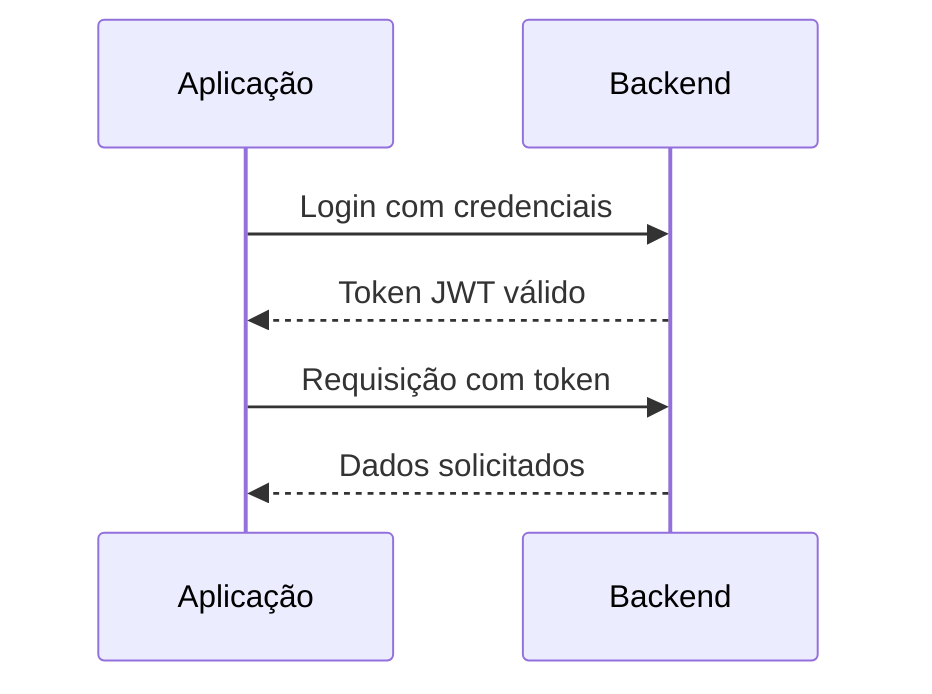

# Rodando o Projeto

## 📌 Instale o Maven

### Verifique se o Maven já está instalado
Abra um terminal e execute:

```sh
mvn -version
```

Se aparecer um erro como **"mvn não é reconhecido como um comando interno ou externo"**, siga os passos abaixo para instalar.

---
### Passo 1: Baixar o Maven
1. Acesse o site oficial: [Maven Download](https://maven.apache.org/download.cgi).
2. Baixe a versão **Binary zip archive**.
3. Extraia o conteúdo para uma pasta, por exemplo: `C:\apache-maven-3.x.x`.
---
### Passo 2: Configurar o PATH 
---
### Windows
1. Abra o **Explorador de Arquivos** e copie o caminho onde extraiu o Maven, por exemplo:
   ```
   C:\apache-maven-3.x.x\bin
   ```
2. No Windows, vá para:
   - **Este Computador** → **Propriedades** → **Configurações Avançadas do Sistema** → **Variáveis de Ambiente**.
   - Encontre a variável **Path**, clique em **Editar** e adicione o caminho acima.
---
### Linux/macOS
Se estiver no Linux ou macOS, edite o arquivo `~/.bashrc`, `~/.zshrc` ou `~/.bash_profile` e adicione:

```sh
export MAVEN_HOME=/caminho/para/maven
export PATH=$MAVEN_HOME/bin:$PATH
```
Depois, execute:

```sh
source ~/.bashrc
```
---


# 📌 Configuração de Ambiente
```sh
# Clone o repositório
git clone https://github.com/joaorossiferreira/autobots-gerson.git

# Entre na pasta do projeto
cd automanager

# Compile o projeto
mvn clean install

# Execute a aplicação
mvn spring-boot:run
```
---

## ✅ Tudo pronto!
### Só acessar a rota **http://localhost:8080/** para começar
<br><br>

## ✅ Novos Recursos Adicionados!
### Na atividade 4 adicionamos as seguintes coisas:
- 🔒 Autenticação e Autorização com JWT 
- 🛜 Perfis de Acesso como ADMIN, GERENTE, VENDEDOR E CLIENTE
- 🔄 Cruds de Usuarios, Gerentes, Vendedores e Clientes
- 🌐 Configurações de segurança como o CORS e Permissões em rotas
<br>

## 🧪 Endpoints Disponíveis 
# Autenticação
POST /auth/login: Realiza o login e retorna o token JWT.
```bash
{
  "nomeUsuario": "admin",
  "senha": "admin"
}
```
### Usuários

#### **GET /usuarios/listar**
- **Descrição**: Lista todos os usuários cadastrados.
- **Acesso**: Apenas **ADMIN** e **GERENTE**.
- **Exemplo de Requisição**:
  - Headers:
    ```
    Authorization: Bearer <SEU_TOKEN_JWT>
    ```
  - Resposta (200 OK):
    ```json
    [
      {
        "id": 1,
        "nome": "Administrador",
        "credencial": {
          "id": 1,
          "nomeUsuario": "admin",
          "senha": "$2a$10$hashedSenha"
        },
        "perfis": ["ROLE_ADMIN"]
      }
    ]
    ```

#### **POST /usuarios/criar**
- **Descrição**: Cria um novo usuário.
- **Acesso**: Apenas **ADMIN**.
- **Exemplo de Requisição**:
  - Headers:
    ```
    Authorization: Bearer <SEU_TOKEN_JWT>
    ```
  - Corpo:
    ```json
    {
      "nome": "Novo Usuário",
      "credencial": {
        "nomeUsuario": "novoUsuario",
        "senha": "senha123"
      },
      "perfis": ["ROLE_GERENTE"]
    }
    ```
  - Resposta (201 Created):
    ```json
    {
      "mensagem": "Usuário criado com sucesso"
    }
    ```

---

### Clientes

#### **GET /clientes/listar**
- **Descrição**: Lista todos os clientes cadastrados.
- **Acesso**: Apenas **ADMIN**.
- **Exemplo de Requisição**:
  - Headers:
    ```
    Authorization: Bearer <SEU_TOKEN_JWT>
    ```
  - Resposta (200 OK):
    ```json
    [
      {
        "id": 1,
        "nome": "Cliente 1"
      }
    ]
    ```

#### **POST /clientes/criar**
- **Descrição**: Cria um novo cliente.
- **Acesso**: Apenas **ADMIN**.
- **Exemplo de Requisição**:
  - Headers:
    ```
    Authorization: Bearer <SEU_TOKEN_JWT>
    ```
  - Corpo:
    ```json
    {
      "nome": "Cliente 1"
    }
    ```
  - Resposta (201 Created):
    ```json
    {
      "mensagem": "Cliente criado com sucesso"
    }
    ```

---

### Gerentes

#### **GET /gerentes/listar**
- **Descrição**: Lista todos os gerentes cadastrados.
- **Acesso**: Apenas **ADMIN**.
- **Exemplo de Requisição**:
  - Headers:
    ```
    Authorization: Bearer <SEU_TOKEN_JWT>
    ```
  - Resposta (200 OK):
    ```json
    [
      {
        "id": 1,
        "nome": "Gerente 1",
        "email": "gerente1@exemplo.com",
        "telefone": "88888-8888"
      }
    ]
    ```

#### **POST /gerentes/criar**
- **Descrição**: Cria um novo gerente.
- **Acesso**: Apenas **ADMIN**.
- **Exemplo de Requisição**:
  - Headers:
    ```
    Authorization: Bearer <SEU_TOKEN_JWT>
    ```
  - Corpo:
    ```json
    {
      "nome": "Gerente 1",
      "email": "gerente1@exemplo.com",
      "telefone": "88888-8888"
    }
    ```
  - Resposta (201 Created):
    ```json
    {
      "mensagem": "Gerente criado com sucesso"
    }
    ```

---

### Vendedores

#### **GET /vendedores/listar**
- **Descrição**: Lista todos os vendedores cadastrados.
- **Acesso**: Apenas **GERENTE**.
- **Exemplo de Requisição**:
  - Headers:
    ```
    Authorization: Bearer <SEU_TOKEN_JWT>
    ```
  - Resposta (200 OK):
    ```json
    [
      {
        "id": 1,
        "nome": "Vendedor 1",
        "email": "vendedor1@exemplo.com",
        "telefone": "77777-7777"
      }
    ]
    ```

#### **POST /vendedores/criar**
- **Descrição**: Cria um novo vendedor.
- **Acesso**: Apenas **GERENTE**.
- **Exemplo de Requisição**:
  - Headers:
    ```
    Authorization: Bearer <SEU_TOKEN_JWT>
    ```
  - Corpo:
    ```json
    {
      "nome": "Vendedor 1",
      "email": "vendedor1@exemplo.com",
      "telefone": "77777-7777"
    }
    ```
  - Resposta (201 Created):
    ```json
    {
      "mensagem": "Vendedor criado com sucesso"
    }
    ```

---

### Serviços

#### **POST /servicos/cadastrar**
- **Descrição**: Cadastra um novo serviço
- **Acesso**: **ADMIN** e **GERENTE**.
- **Exemplo de Requisição**:
  - Headers:
    ```
    Authorization: Bearer <SEU_TOKEN_JWT>
    ```
  - Corpo:
    ```json
    {
      "nome": "Troca de óleo",
      "valor": 150.00,
      "descricao": "Troca de óleo e filtro"
    }
    ```

  - Resposta (201 Created):
    ```json
    {
      "mensagem": "Serviço criado com sucesso"
    }
    ```

#### **GET /servicos/listar**
- **Descrição**: Lista todos os serviços cadastrados
- **Acesso**: **ADMIN**, **GERENTE** e **VENDEDOR**.
- **Exemplo de Requisição**:
  - Headers:
    ```
    Authorization: Bearer <SEU_TOKEN_JWT>
    ```
  - Resposta:
    ```json
      {
        "id": 1,
        "nome": "Troca de óleo",
        "valor": 150.00,
        "descricao": "Troca de óleo e filtro"
      },
      {
        "id": 2,
        "nome": "Alinhamento",
        "valor": 120.00,
        "descricao": "Alinhamento e balanceamento"
      }
    ```

---

### Mercadorias

#### **POST /mercadorias/cadastrar**
- **Descrição**: Cadastra uma nova mercadoria
- **Acesso**: **ADMIN** e **GERENTE**.
- **Exemplo de Requisição**:
  - Headers:
    ```
    Authorization: Bearer <SEU_TOKEN_JWT>
    ```
  - Corpo:
    ```json
    {
      "nome": "Óleo 10W40",
      "quantidade": 50,
      "valor": 45.90,
      "descricao": "Óleo sintético 1L"
    }
    ```

  - Resposta (201 Created):
    ```json
    {
      "mensagem": "Mercadoria criada com sucesso"
    }
    ```

#### **GET /servicos/listar**
- **Descrição**: Lista todas as mercadorias cadastradas
- **Acesso**: **ADMIN**, **GERENTE** e **VENDEDOR**.
- **Exemplo de Requisição**:
  - Headers:
    ```
    Authorization: Bearer <SEU_TOKEN_JWT>
    ```
  - Resposta:
    ```json
    {
      "id": 1,
      "nome": "Óleo 10W40",
      "quantidade": 50,
      "valor": 45.90,
      "descricao": "Óleo sintético 1L"
    },
    {
      "id": 2,
      "nome": "Filtro de ar",
      "quantidade": 30,
      "valor": 32.50,
      "descricao": "Filtro de ar esportivo"
    }
    ```

---

### Vendas

#### **POST /vendas/cadastrar**
- **Descrição**: Lista todas as vendas realizadas pelo vendedor logado
- **Acesso**: **VENDEDOR**.
- **Exemplo de Requisição**:
  - Headers:
    ```
    Authorization: Bearer <SEU_TOKEN_JWT>
    ```
  - Corpo:
    ```json
    {
      "cadastro": "2025-06-05T10:00:00",
      "cliente": {
        "id": 1
      },
      "servicos": [
        {
          "id": 1
        }
      ],
      "mercadorias": [
        {
          "id": 1,
          "quantidade": 2
        }
      ]
    }
    ```

  - Resposta (201 Created):
    ```json
    {
      "mensagem": "Venda criado com sucesso"
    }
    ```

#### **GET /vendas/minhas-vendas**
- **Descrição**: Lista todas as vendas realizadas pelo vendedor logado
- **Acesso**: **VENDEDOR**.
- **Exemplo de Requisição**:
  - Headers:
    ```
    Authorization: Bearer <SEU_TOKEN_JWT>
    ```
  - Resposta:
    ```json
    [
      {
        "id": 1,
        "cadastro": "2025-06-05T10:00:00",
        "cliente": {
          "id": 1,
          "nome": "Cliente 1"
        },
        "servicos": [
          {
            "id": 1,
            "nome": "Troca de óleo",
            "valor": 150.00
          }
        ],
        "mercadorias": [
          {
            "id": 1,
            "nome": "Óleo 10W40",
            "valor": 45.90,
            "quantidade": 2
          }
        ]
      }
    ]
    ```

#### **GET /vendas/minhas-compras**
- **Descrição**: Lista todas as compras do cliente logado
- **Acesso**: **CLIENTE**.
- **Exemplo de Requisição**:
  - Headers:
    ```
    Authorization: Bearer <SEU_TOKEN_JWT>
    ```
  - Resposta:
    ```json
    [
      {
        "id": 1,
        "cadastro": "2025-06-05T10:00:00",
        "funcionario": {
          "id": 3,
          "nome": "Vendedor 1"
        },
        "servicos": [
          {
            "id": 1,
            "nome": "Troca de óleo",
            "valor": 150.00
          }
        ],
        "mercadorias": [
          {
            "id": 1,
            "nome": "Óleo 10W40",
            "valor": 45.90,
            "quantidade": 2
          }
        ]
      }
    ]
    ```

---

## 🎯 Permissões por Perfil

| Rota                   | ADMIN | GERENTE | VENDEDOR | CLIENTE |
|------------------------|-------|---------|--------|---------|
| `/auth/login`          | ✅    | ✅      | ✅     | ✅      |
| `/usuarios/listar`     | ✅    | ✅      | ❌     | ❌      |
| `/clientes/listar`     | ✅    | ❌      | ❌     | ❌      |
| `/gerentes/listar`     | ✅    | ❌      | ❌     | ❌      |
| `/vendedores/listar`   | ❌    | ✅      | ❌     | ❌      |
| `/servicos/cadastrar`    | ✅    | ✅      | ❌     | ❌      |
| `/servicos/listar`       | ✅    | ✅      | ✅     | ❌      |
| `/mercadorias/cadastrar	` | ✅    | ✅      | ❌     | ❌      |
| `/mercadorias/listar` | ✅    | ✅      | ✅     | ❌      |
| `/vendas/cadastrar` | ❌    | ❌      | ✅     | ❌      |
| `/vendas/minhas-vendas` | ❌    | ❌      | ✅     | ❌      |
| `/vendas/minhas-compras` | ❌    | ❌      | ❌     | ✅      |


<br>


## 🔄 Fluxo de Autenticação JWT

