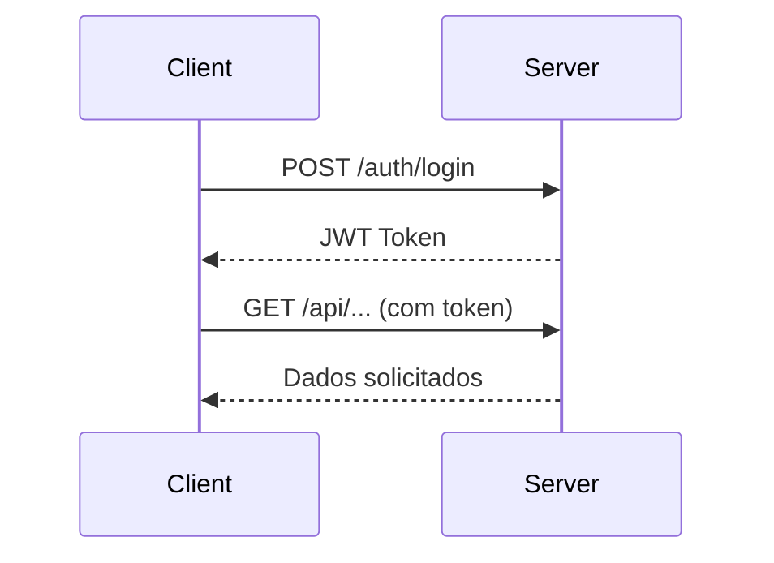

# Rodando o Projeto

## 📌 Instale o Maven

### Verifique se o Maven já está instalado
Abra um terminal e execute:

```sh
mvn -version
```

Se aparecer um erro como **"mvn não é reconhecido como um comando interno ou externo"**, siga os passos abaixo para instalar.

---
### Passo 1: Baixar o Maven
1. Acesse o site oficial: [Maven Download](https://maven.apache.org/download.cgi).
2. Baixe a versão **Binary zip archive**.
3. Extraia o conteúdo para uma pasta, por exemplo: `C:\apache-maven-3.x.x`.
---
### Passo 2: Configurar o PATH 
---
### Windows
1. Abra o **Explorador de Arquivos** e copie o caminho onde extraiu o Maven, por exemplo:
   ```
   C:\apache-maven-3.x.x\bin
   ```
2. No Windows, vá para:
   - **Este Computador** → **Propriedades** → **Configurações Avançadas do Sistema** → **Variáveis de Ambiente**.
   - Encontre a variável **Path**, clique em **Editar** e adicione o caminho acima.
---
### Linux/macOS
Se estiver no Linux ou macOS, edite o arquivo `~/.bashrc`, `~/.zshrc` ou `~/.bash_profile` e adicione:

```sh
export MAVEN_HOME=/caminho/para/maven
export PATH=$MAVEN_HOME/bin:$PATH
```
Depois, execute:

```sh
source ~/.bashrc
```
---

## 📦 Estrutura do Projeto

src/ <br>
├── main/ <br>
│ ├── java/ <br>
│ │ └── com/example/demo/ <br>
│ │ ├── config/ # Configurações de segurança e JWT <br> 
│ │ ├── controller/ # Endpoints REST <br>
│ │ ├── entity/ # Entidades do banco de dados <br>
│ │ ├── repository/ # Repositórios JPA <br>
│ │ ├── service/ # Lógica de negócios <br>
│ │ └── util/ # Utilitários (JWT, etc.) <br>
│ └── resources/ <br> 
│ └── application.properties <br>

---

## 🔧 Configuração

### Pré-requisitos
- Java 17+
- MySQL 8+
- Maven

### Banco de Dados
1. Crie o banco:
```properties
CREATE DATABASE autobots_gerson;
```

2. Configure o application.properties:
```properties
spring.datasource.url=jdbc:mysql://localhost:3306/autobots_gerson
spring.datasource.username=seu_usuario
spring.datasource.password=sua_senha
spring.jpa.hibernate.ddl-auto=update
```


## 📌 Configuração de Ambiente
```sh
# Clone o repositório
git clone https://github.com/joaorossiferreira/autobots-gerson.git

# Entre na pasta do projeto
cd automanager

# Compile o projeto
mvn clean install

# Execute a aplicação
mvn spring-boot:run
```
---

## ✅ Tudo pronto!
### Só acessar a rota **http://localhost:8080/** para começar
<br><br>

## ✅ Novos Recursos Adicionados!
### Na atividade 5 foram adicionadas as seguintes coisas:
- 🔒 Sistema de Autenticação JWT completo 
- 🛜 4 Perfis de Acesso diferenciados:
  - ADMIN: Acesso total
  - GERENTE: Gestão de vendedores e produtos
  - VENDEDOR: Operações de vendas
  - CLIENTE: Acompanhamento de serviços
- 🔄 CRUDs Especializados:
  - Usuários com herança de perfis
  - Gestão completa de veículos
  - Controle de estoque de mercadorias
- 🌐 Configurações Avançadas:
  - CORS configurado
  - Rotas protegidas por autorização
  - Validação de tokens em todas as requisições
<br>

## 🧪 Endpoints Disponíveis 
### 🔐 Autenticação JWT
#### ****POST /auth/login****
- **Descrição**: Lista todos os usuários cadastrados.
```bash
{
  "nomeUsuario": "admin",
  "senha": "admin"
}
```

- **Use em requisições o token que vc obteu**
```bash
13bh12hj412j512512u58912n76789479146712756n80716024619264819808971237nv857120 #exemplo
```
### 🌐 Endpoints RESTful

#### **Clientes**
- **GET** `/api/clientes` - Lista todos os clientes.
- **GET** `/api/clientes/{id}` - Retorna o cliente pelo ID.
- **POST** `/api/clientes` - Cria um novo cliente.
- **PUT** `/api/clientes/{id}` - Atualiza um cliente.
- **DELETE** `/api/clientes/{id}` - Remove um cliente.

#### **Funcionários**
- **GET** `/api/funcionarios` - Lista todos os funcionários.
- **GET** `/api/funcionarios/{id}` - Retorna o funcionário pelo ID.
- **POST** `/api/funcionarios` - Cria um novo funcionário.
- **PUT** `/api/funcionarios/{id}` - Atualiza um funcionário.
- **DELETE** `/api/funcionarios/{id}` - Remove um funcionário.

#### **Serviços e Mercadorias**
- **GET** `/api/servicos` - Lista todos os serviços/mercadorias.
- **GET** `/api/servicos/{id}` - Retorna um serviço/mercadoria pelo ID.
- **POST** `/api/servicos` - Cria um novo serviço/mercadoria.
- **PUT** `/api/servicos/{id}` - Atualiza um serviço/mercadoria.
- **DELETE** `/api/servicos/{id}` - Remove um serviço/mercadoria.

#### **Vendas**
- **GET** `/api/vendas` - Lista todas as vendas.
- **GET** `/api/vendas/{id}` - Retorna uma venda pelo ID.
- **GET** `/api/vendas/periodo?inicio={inicio}&fim={fim}` - Lista vendas em um período.
- **POST** `/api/vendas` - Cria uma nova venda.
- **PUT** `/api/vendas/{id}` - Atualiza uma venda.
- **DELETE** `/api/vendas/{id}` - Remove uma venda.

#### **Veículos**
- **GET** `/api/veiculos` - Lista todos os veículos.
- **GET** `/api/veiculos/{id}` - Retorna um veículo pelo ID.
- **GET** `/api/veiculos/cliente/{clienteId}` - Lista veículos de um cliente.
- **POST** `/api/veiculos` - Cria um novo veículo.
- **PUT** `/api/veiculos/{id}` - Atualiza um veículo.
- **DELETE** `/api/veiculos/{id}` - Remove um veículo.


---

## 🎯 Permissões por Perfil

| Perfil          | Acessos |
|-----------------|-------|
| ADMIN           | Todos os recursos    | 
| GERENTE          | Vendedores, serviços, mercadorias    | 
| VENDEDOR          | Vendas, clientes    | 
| CLIENTE          | 	Suas compras    | 


<br>


## 🔄 Fluxo de Autenticação JWT

